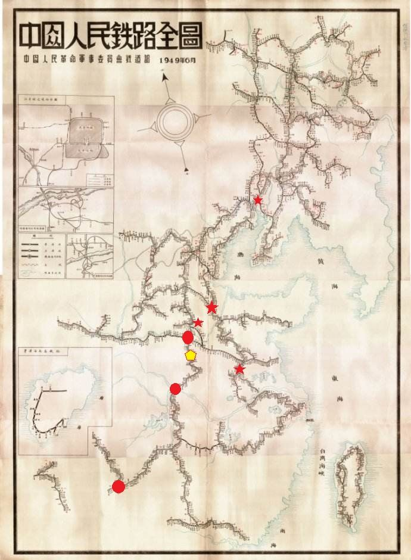
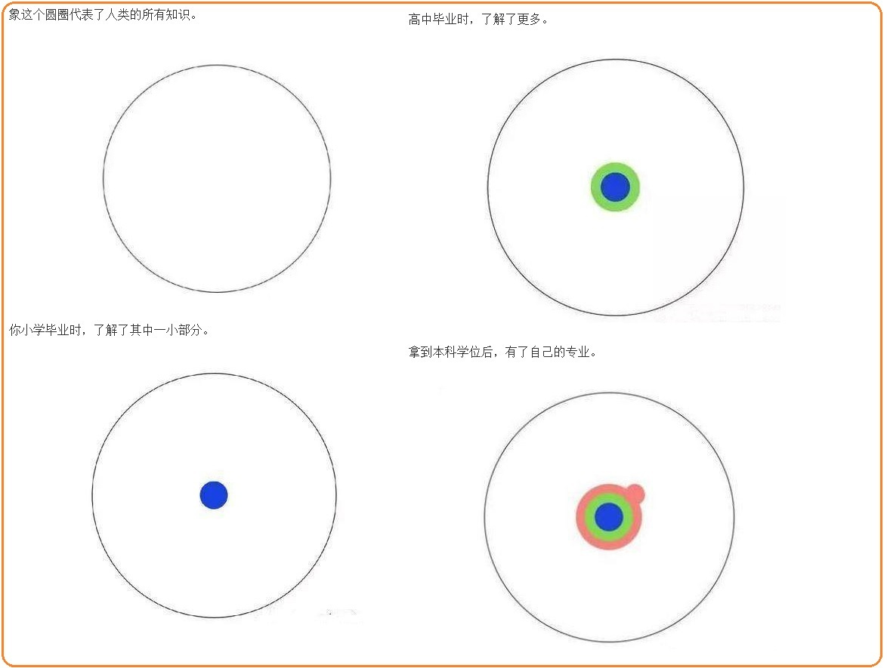
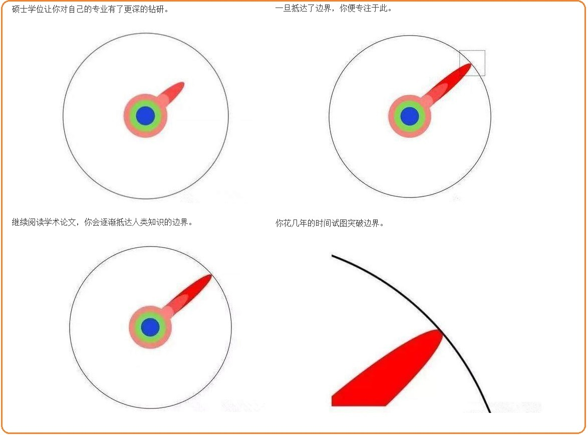
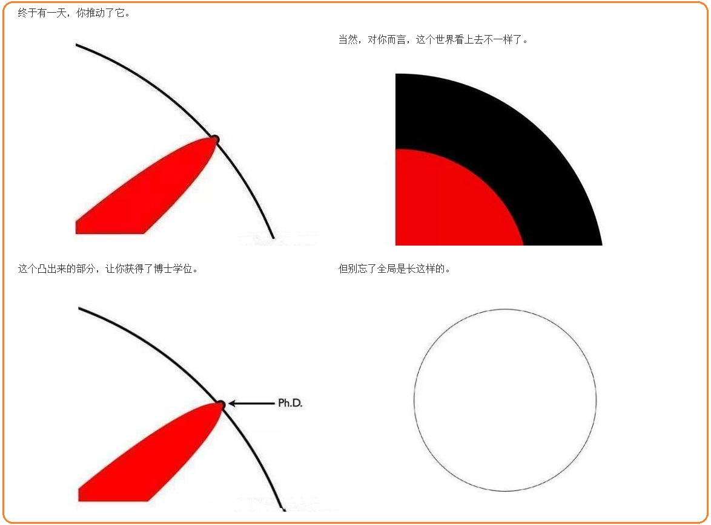
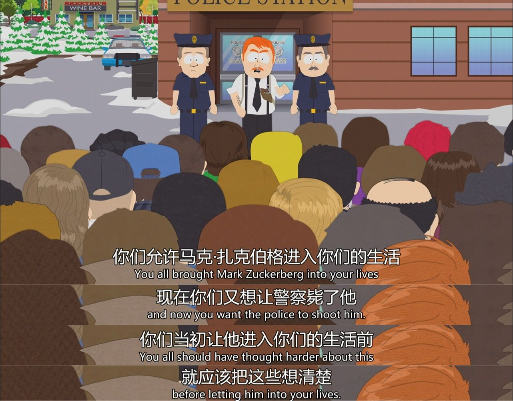
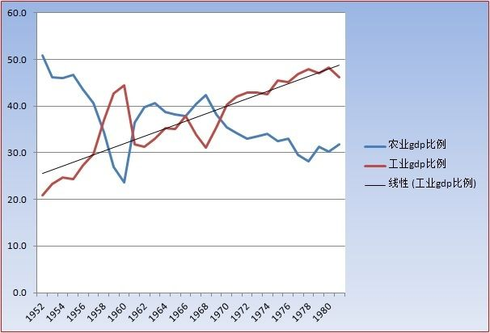

> 本文系转载，原创作者 @马前卒（知乎账号已被销号）
>
> 原文地址：https://zhuanlan.zhihu.com/p/32925423

# 保卫我们的现代生活--18年1月讲稿整理

## 一 刚刚学会吃

大家好，欢迎来到番禺路。如果大家是从延安西路方向过来的，会路过一家卖柳州螺蛳粉的小店，是我经常吃夜宵的地方。自从2012年《舌尖上的中国》上映，螺蛳粉就成了柳州的城市名片，全国各地都能找到广西螺蛳粉店。上个月，中国国家地理杂志派我去柳州采访，我在当地专门调查了螺蛳粉的历史。

关于螺蛳粉的起源，当地有几种说法，有说是工厂食堂给夜班工人提供夜宵发明的；有说是工人电影院散场后大排档老板为了迅速煮粉发明的；有说是很多外地人半夜下火车要吃饭，小店老板只剩下螺蛳汤和米粉，临时拼凑出来的。这些说法的共同点是，螺蛳粉肯定不是什么古代食品，也不是家庭厨房里面的创造，而是现代餐饮企业为了快速批量制作而发明的快餐。

反过来看，其实螺蛳粉天生就有做优秀快餐的潜质。

首先，它用的是干切粉，不是湿粉，主要原料好运输；其次，把螺蛳预先煮化在汤里，油水和味道很足，便于快速制作油水很足的热汤粉；第三，配料是腐竹、酸笋、酸菜、花生米，和一小把青菜，大多数配料比较耐储存。这几条优点都接近于方便面。所以，柳州螺蛳粉占领全国市场，一半是靠开店，一半是袋装的方便面式销售。柳州卖给全国的袋装螺蛳粉，去年销售额超过30亿。

这么大的一个产业，历史有多长呢？上面的叙述说了，先有现代社会的市场需求，然后才有螺蛳粉这种食品，它的历史不会太长。三四种关于螺蛳粉起源的说法，最远也就追溯到70年代末，比我大不了几岁。

再看其他城市的标志性食品，其实大多数历史也并不长。

比如说河南烩面，1956年出现在郑州，是饭店公私合营之后，为了批量制作热汤面而发明的。

武汉热干面，是1930年左右发明的，饭店老板每天做面条的半成品，做少了不够，做多了会粘在一起，他就想办法在面条上拌了一些油和芝麻酱，结果大受欢迎，成了今天可以代表武汉人的特色食品。

螺蛳粉、热干面、河南烩面，这几种食品的共同点是工艺简单，可以预先储备大量半成品，随着市场需求快速制作。从地理上说，还有一个共同点是它们都诞生在铁路枢纽。武汉、柳州、郑州，都是解放前的铁路节点，都是后来跨省大铁路局的驻地。20世纪中国主要的交通方式是铁路，只有铁路才能带来现代社会和流动人口，所以铁路枢纽最容易诞生符合我们现代人口味的美食。河南烩面没有诞生在洛阳或者开封，而是诞生在20世纪形成的铁路枢纽郑州，就很说明问题了。

和这几种食品类似的，还有中国四大名鸡。德州扒鸡、河南道口烧鸡、锦州沟帮子熏鸡、符离集烧鸡，每种鸡对应一个近代铁路要地，不是铁路交叉点就是需要停下来换车头的路局分界点。它们的口味虽然有差异，但都是含水量低，容易携带，能长时间保存的肉食，原料都是鸡肉这种最廉价的肉类。这和螺蛳粉、热干面一样，都是中国铁路时代的食品。

但是，我们注意一下上面的提到的所有食品，他们有个共同特点，缺乏新鲜蔬菜。为什么中国的第一代铁路食品没有新鲜蔬菜呢？因为蔬菜和大多数水果并不适合铁路运输。铁路只能沿着固定的线路走，没法及时搜集分散生产的蔬菜。就算上了车，一个车皮经常要一两个星期才到地方，蔬菜往往也坏了，80年代之前城市供应大白菜是要国家领导人过问的大事。所以，20世纪的铁路枢纽不缺流动人口，不缺粮食，不缺咸菜和调味品，但新鲜蔬菜的供应比较差。中国流动人口要在交通枢纽吃到蔬菜比例高的美食，得等到公路时代。

公路时代美食的代表就是80年代末，90年代初出现的新疆大盘鸡。

大盘鸡的正确称呼是沙湾大盘鸡。沙湾县一头是乌鲁木齐，一头是克拉玛依，夹在新疆最大城市和大油田之间。2010年之前，克拉玛依没有铁路，所以沙湾县的公路交通密度比全国平均水平高得多，很早就能解决蔬菜运输问题。前面我提到过，鸡肉是最廉价的肉类，这鸡肉再加上青椒、土豆、洋葱、辣椒，就是我们熟悉的新疆大盘鸡。大盘鸡沿着公路普及到全国的过程，与中国变成世界第一汽车生产大国的发展历程是重合的。

刚才举了这么多例子，就是想提醒大家：我们走在街上看到的民间美食，相当大一部分是最近几十年出现的。为什么呢？其中第一个重要原因是在铁路和轮船出现之前，没有那么大规模的流动人口提供需求，也就没有多少面向平民的饭店和食品。

鸦片战争之前，就连咸菜这种容易运输，容易储存的的东西，都是各地自己吃自己。第二次鸦片战争结束后，英国轮船进了长江，武汉和上海出现了现代工商业，有了流动人口，形成了沿长江的食品市场，这才有了榨菜。1898年，毛泽东5岁了，蒋介石已经读了好几年私塾，涪陵的企业才腌出第一坛榨菜，但是有上海和武汉这两个大市场支持，再加上后来的铁路网，到了1940年，涪陵榨菜已经是全国性的快餐食品。这东西和德州扒鸡、热干面一样，都是中国第一次工业革命时代的典型食品。

最近几十年出现大量美食的原因还有原料的运输。前面说了大盘鸡的例子，我再说一个例子，大家猜猜河南的王守义十三香是哪年出现的？是1959年，比武汉长江大桥晚两年。几千年来，因为交通不便，香料只要离开产地，到别的气候带都是奢侈品。现在武汉长江大桥打通了京广铁路，第一次把中国南北连接起来，北方人也能廉价获得南方香料了，所以在京广线上的驻马店出现了廉价的混合食品香料。（上面的黄色标记点）

当然王守义家族不承认这一点，坚持说自己的香料有上千年的历史，这我也不想去考证。反正之前他们的家族配方没改变中国人的食谱，1959年卖一毛钱一包的王守义十三香才是大众调味料的起点，现在一两包装的十三香也不过几块钱。这毫无疑问是工业化社会制造的美食。

（补充一句，兰州拉面出现于1915年，刚好是兰州黄河铁桥出现后）

但是，最关键的一点是，农业社会的人根本就没有资格讲究美食。人总是要先吃饱再谈口味的。如果没有足够的粮食、盐和油脂，其他一切美食都没有意义。1998年我上大学，有个贫困山区出来的室友，他在读大学之前一直认为方便面是奢侈品，算得上美食，就是因为方便面能快速满足粮食、盐和油脂的需求。

再举两个例子，我家在燕山深处的平泉县，特产是蘑菇，全县40多万人，一年生产50万吨蘑菇。但是过去粮食少的时候很少有人说蘑菇好吃，因为蘑菇热量低啊，没吃饱之前谁有心情搞这个吃。后来我去辽宁营口市，那里把皮皮虾叫虾爬子，当地人说，60年代粮食不够吃，最穷的人家才去海边搞点虾爬子。为什么穷人才吃皮皮虾？因为皮皮虾的热量和脂肪含量都很低，在没吃饱之前去捞皮皮虾，耗费的能量得不偿失。在那个时代，最好的美食就是粮食、油脂和盐的组合，典型的例子是猪油拌饭。今天还有人拿这个当美食吗？

此外，那时候中国煤产量很低，绝大多数农民家里是没有炉子的，只有一个煮饭加取暖的大灶，所以就算有油，炒菜也是奢侈品。直到我小时候，80年代，周围的农民说弄几个炒菜，也必然是家里有贵客要来了。各地真正能追溯到几百年前的民间菜系，主要就是炖菜，比如东北的猪肉炖粉条。

最后再补充一点，古代没有味精，能提供鲜味的东西只有老母鸡和海鲜熬的浓缩汤。普通的人家和饭店用不起这么昂贵的调味料，只有以山东孔府菜为代表的高端鲁菜才会用足够的母鸡汤和海味来制造美食。大多数中国人可能一辈子都没体会过鲜味，也就是谷氨酸钠的味道。

等到中国人富起来，粮食，油和盐普及、普通人家也能用煤气灶和味精，中国人对美食的概念和农业时代就完全不一样了。最典型的例子是川菜取代鲁菜，成为中国街头的主流菜系。因为川菜用火多，用海鲜少，用鸡汤提味的菜不多，最适应煤气灶和味精时代的操作水平和饮食习惯，比较刺激的味道也适应平民的需求。

川菜取代鲁菜，不仅仅是因为川菜适应新时代。实际上，和前面提到的德州扒鸡，武汉热干面一样，大多数川菜也是最近一个世纪才出现的。比如说鱼香肉丝、夫妻肺片、酸辣粉、麻辣火锅、重庆小面都是民国年间才有，比在座很多人的祖父还年轻。麻辣香锅、万州烤鱼，这都是21世纪才出现的菜，出现的时候我都快大学毕业了。川菜也同样是中国现代社会的产物，所以能排挤贵族时代的鲁菜。

中国农业文明有几千年的历史，为什么这么多熟悉的食品都是最近100年乃至几十年才出现呢？我可以用小学算术来解答这个问题——3000年历史，相对最近100年是几十倍的优势；但现代社会的人口总数比古代大多数时间多几十倍，能享受美食的人口比例也要高个几十倍。

如果我们接受下面这个粗略的公式：

> 人口总数x能享受美食的人口比例x历史长度=美食积累

那么，现代社会两个几十倍乘起来，当然压倒古代几十倍的时间优势。这还没考虑过烹饪工具进步对美食的影响呢。

所以最近几代人的饮食文化积累比之前几千年更多，所以当代中国人的饮食习惯和农业社会完全割裂，《舌尖上的中国》虽然拼命渲染“传统美食”，但我们当代人舌尖上的中国，在很大程度上比我们的父母还年轻。

## 二 历史的重量

上面那个算术计算，我们可以推广一下，用来估算全部的文化遗产：

> 总人口x能参与文化活动的比例x时间=文化积累

这里我先请大家估算一下，从出现文明开始，到21世纪，中国这片土地上一共生活过多少人？

这个数字我也不知道，但我看过几个全世界的数据，认为自古以来一共出生过800-1000亿人。

而无论哪朝哪代，中国文明大致上都是全球人口比例的四分之一到五分之一，所以自古以来的中国人总数大概是200亿。反过来说，我们按5000年文明算，25岁一代人，一共是200代人，200亿除以200代，是一亿人，每代人一亿，这数字只多不少，所以200亿的总数应该也是偏多的。

这200亿中，有多少人在新中国生活过呢？我这里也有个估算。中国人均寿命是70多岁，建国到现在是69年，所以，建国时已经出生的人，现在大多数去世了；建国时没出生的人，现在大多数还活着。在中华人民共和国生活过的中国人总数，大致就是现在的人口加上建国时的人口，约为20亿。和自古以来的200亿中国人相比，大概是1比10的关系。

但是，很显然，创造和传承文化的比例，不能按1:10来算，别的不说，新中国这20亿人，受过教育的比例，，肯定要比之前的180亿高一个数量级。而创造文化产品的能力基本和受教育比例成正比的。所以仅仅是教育一项，20亿人就能打平之前的180亿。更不要说现代的教育比古代强的多，现代人在学校之外接受文化产品的数量，吸收知识的数量也比古代多了十倍不止。粗略地估算一下，在我们总的文化遗产里面，新中国起码要占一半。

我猜会有人质疑我，说古代的教育和现在的教育怎么能比呢？李白杜甫怎么能和现代这些小学生相提并论呢？对此我也不争论，文无第一，武无第二，很多东西没法量化比较的。但我还是能找一些证据。

我现在住在苏州工业园区，这个地方过去叫唯亭镇，在苏州乃至全国都是文化发达的地方。发达到什么程度呢？清朝道光年间，一个镇就有自己的地方志，总编是一个翰林，这经济文化水平至少相当于内地的普通县城，甚至是府城。我在网上偶然看到这部地方志，摘抄了一些被记到地方志上的诗词，应该算是本地文人的高水平作品：

> 王鏊《唯亭》：
早朝时去晚朝回，陆市巴城迤逦来。咫尺唯亭看又过，人生行止信悠哉。

> 陈元素《送何仲先移家唯亭》：
周亲与我更芳邻，徙宅超然远市尘。路出东门船似马，湖当前岸浪如银。
谁能父子相师友，岂少贤豪互主宾。潮到此亭曾有谶，知君才不让前人。

> 李汾《唯亭》：
晓市争先集，唯亭水陆通。一江分上下，两庙划西东。
烟火千家爨，斜阳孤客篷。昔贤图八景，风雅有谁同。

> 查诜《武顺王祠》：
英姿飒爽镇三吴，日照唯亭庙貌孤。欲把美人配名将，中山祠在莫愁湖。

我不知道各位怎么看这些诗。抛开文体的区别，我觉得文采、用词和立意，也就是中学生流水账水平，还不能是写作文特别好的那种。和这种诗词最像的，应该是老干部活动中心走廊上挂着的那些诗词，是那些参加工作后才补习到中学水平的老干部作品。我觉得这是古代一般知识分子的真实面貌。之所以我们觉得古人文化水平高，是因为只有优秀的作品才能流传下来，日常的作品流传不下来而已。

一定要做个比较的话，我之前算过一个比例，清朝后期三四亿人口，每年生产2万秀才；我们现在十三四亿人口，是清朝的四倍，本土博士和海归博士加起来每年七八万的样子，也是清朝的四倍。换句话说，按照人口比例算，今天的博士大概相当于古代的秀才。

但是呢，我们知道，秀才是古代知识分子的最底层，99%的秀才最多只能算是文化的传承者，而不能创造新的文化成就。我们今天正好相反，作为博士，你必须通过论文和实验，给人类增加一些之前没有的知识，换句话说每个博士都是文化的创造者。之前有一组图片，分析博士的定义，我觉得很贴切：

这说明，古代社会只有在所有知识分子都创造文化的情况下，才可能接近现代社会的文化生产效率相提并论。但实际上呢？不说百分之一，就算千里选一的古代知识分子也未必能做出一点前人没做过的成就。我说最近这20亿人的文化积累和之前180亿相当，实际上还是给我们的祖先留面子了。

我再拿几个数据来看看：

咱们国家有个传统，统一的朝代不仅仅要写历史，还要把已知的书籍收集归类，编成“类书”出版，基本上就是当时的文化成果汇总。其中最著名的就是明朝的《永乐大典》不到4亿字；清朝的《四库全书》8亿字；《古今图书集成》虽然名字气魄很大，1.6亿字。

一亿字是什么概念呢？年底的时候知乎给我发了一个统计数字，我这一年在知乎写了160万字，读了9800万字，差一点不到一亿。当然我大多数阅读就是快速泛读，但这也说明，如果不要求精读的话，我用十几年时间可以读完清代之前的大多数文化遗产，至少一辈子总能读完。这也符合我对《四库全书》的直接感受——我老家承德避暑山庄有个文津阁，装有完整的一套《四库全书》，我给大家看一下这个建筑的照片，应该可以对古代文化积累数量有一个直观认识：

历朝历代积攒下来的东西就这么一点，这说明一个问题——古代人对之前的文化遗产的了解，比如说明朝人对唐朝的了解，肯定不如我们。现在历史上任何一个朝代，全国都有上百个专职研究者，比如说宋史研究会，全国仅理事就三四十人，全国500多会员，开一次年会要讨论几百篇论文。这比古代编史书的人还要多得多，除了宋朝人自己，最了解宋朝的时代就是现在，而不是元明清任何一朝。

怎么说研究的更透呢？我举个直观的例子，古代最大的收藏家是皇帝，尤其是那种活得长，喜欢展示自己文化水平的皇帝。清朝乾隆皇帝收集了不计其数的书画，其中最好的一部分被搬到台湾去了。结果最近几十年慢慢翻出来研究，发现他收藏的宋朝书画，一多半是假的，著名的那张富春山居图，皇家当真品收藏的那张，现在研究起来也多半不是真的。所以说，就算比对历史了解，也是古人不如现在。所以我认为，如果以1900年为界，之后积累的文化产品无论在数量还是质量上，都完全压倒之前几千年。

## 三 我是谁？

前面对文化遗产的“计算”怎么影响我们每个人的生活呢？

我们人是社会动物，而社会又是通过道德、法律等文化产品搭建起来的。全社会的文化遗产，体现在我们个人身上，最重要的作用就是定义一个“我是谁”的概念。

设想一下，你在陌生的社交场合被人要求介绍自己。你怎么介绍？显然不会是名字加身份证号码，那是面对警察盘问才会干的事情。你会说我是某某的儿子，某个学校的校友，某个游戏的玩家，这才是你定义自己的方式。而我和在座各位，面对整个世界都有一个共同的自我定义——中国人。

但这个最普遍的定义，却是个很新的概念。我妈妈年轻时在山区当乡村教师，经常科普的一个知识点就是“我是中国人”。在那之前的几千年，大多数人不仅不知道这个概念，甚至不认为“我是哪国人”是个有意义的问题。

因为这个问题包含了现代社会才有的两重文化背景。第一个是全球视角，要知道世界上还有和中国并列的国家；第二个是国民意识，要认识到自己是国家的一部分，国家的政策和自己的日常生活有明确的互动。古代的老百姓第一不知道世界格局，第二不觉得国家和自己的生活有什么关系，换个皇帝自己还是一样生活，除非有时候活不下去主动换个皇帝。但就算李自成当了皇帝，几十年过后日子还是一样，所以古代老百姓几乎不会问自己是哪国人。

这种日子一直持续到鸦片战争，帝国主义给中国带来了侵略，传统的儒家社会和封建军阀抵抗不了帝国主义，我们有了建立现代国家的需要。另一方面，帝国主义也带来了先进的技术和思想，我们从此也有了建立现代国家的可行性。最激烈的一次入侵是20世纪日本的入侵，现代中国的文化概念就是从这次战争中开始形成的。到现在我们的国歌还是抗战期间的电影配乐；歌词还是“中华民族到了最危险的时候”，这说的就是我们当初为什么要建立一个现代国家。

外部压力迫使我们团结起来，建立强大的军队，建立发达的工业，成为帝国主义不敢再侵略的现代国家。但这个需求只是描述了现代化社会的硬件，并没有具体解释“中国人”这三个字的文化内涵。我们还是要回答，我们在文化上是谁？我们为什么要彼此认为是同胞？是不是因为一些更古老的因素？

中国人的定义中，肯定包含一些古老的因素，比如说中文方块字。但是更多的文化符号其实出现很近，和川菜的历史差不多。比如说“炎黄子孙”这个概念，在20世纪之前，并不是中国人的代名词。炎帝黄帝虽然在三皇五帝的序列里面是比较重要的角色，但最多也就是一部分帝王和世家大族宣称自己有炎黄血脉，普通中国人并没有认这个祖宗的想法。就算朱元璋祭黄帝，文字中也没有一丝一毫认祖宗的意思。

> 明太祖洪武四年（公元1371年）祭文

> 皇帝谨遣中书管勾甘，敢昭告於黄帝轩辕氏：

> 朕生後世，为民於草野之间。当有元失驭，天下纷纭，乃乘群雄大乱之秋，集众用武。荷皇天后土眷佑，遂平暴乱，以有天下，主宰庶民，今已四年矣。

> 君生上古，继天立极，作烝民主，神功圣德，垂法至今。朕兴百神之祀，考君陵墓於此，然相去年岁极远；观经典所载，虽切慕於心，奈禀生之愚，时有古今，民俗亦异。仰惟圣神，万世所法，特遣官奠祀修陵，圣灵不昧，其鉴纳焉！尚飨！

（祭文更像是对优秀”同行“的致敬）

但是，1900年前后，大家都知道清朝要亡了，一部分革命党要用黄帝子孙的身份激发汉族的民族主义，推翻清朝；还有一部分革命党和改良派想用炎黄子孙的旗号来打造一个中华民族，把少数民族定义成黄帝子孙的分支，不止要统一汉族地区，还要继承清朝和历代王朝的边疆遗产。这才有了炎黄子孙的概念。1912年，民国建立第一年，孙中山就派人祭祀黄帝陵，开启了现代国家祭黄帝的先例。

孙中山和之后的国共两党祭皇陵，和历代祭黄帝陵是有区别的。之前祭黄帝陵，是把他当成比较古老的帝王和神灵，和其他神仙或者古代帝王的祭祀相比，并不特别突出。民国祭黄帝陵的时候，放弃了历朝历代大多数祭祀，专门祭黄帝陵，而且要声称这是中国人的始祖。这才在20世纪打造了炎黄子孙的概念。后来抗战前期，国共两党轮番去祭祀，并不是因为他们真信，而是两党都想借这个来证明自己是孙中山的后继者，拥有领导中国反抗日本侵略的合法性。1944年，日本发动最后一波大进攻，打得国民党差点放弃重庆，在这一片混乱中，国民党政府没忘了改地名，把过去的中部县，改成现在的黄陵县，也是在文化上标志自己是现代国家的中央政府。

除了炎黄子孙的概念，我们还有一个说法，说中国人是“龙的传人”。但实际上，古代的龙是水神，是皇家的代表，但从来没有做中国人祖先的说法。一直到了1978年，因为中美建交，台北的国民党政权感觉自己被美国抛弃了，一片混乱，台湾音乐人侯德健想重新表述一下中国的民族主义，写了《龙的传人》这首歌，这才有了龙的传人的概念。1988年是龙年，侯德健被邀请到春晚唱这首歌，这个概念才在大陆扎根。

这说明，认谁当祖先，是一个很偶然的事情。如果清末的革命党选了大禹，选了伏羲当始祖；如果侯德健写了不一样的歌词，我们今天也会有另一番说法。但中国人和中华民族的文化概念也不会因此改变。说明我们今天界定中国人并不是依赖这些20世纪才发明的文化符号。

那么到底中国人这个概念意味着什么呢？我可以从反面论述这个问题：

我们平时骂人，有一个常用句式是：“XXX你不是人！”。但我们都知道，骂人改变不了别人的DNA，从生物学角度说这句话毫无意义。那么这句话其实是从社会学角度说的，说的是对方不遵守伦理道德底线，比如说偷了别人的养老钱，已经没有做人的资格了。

从这句话反推出来，就是说，人的定义来自于统一的伦理道德，中国人的定义就是指你遵守这个国家的主流伦理道德。我们这一群人赞赏什么、反对什么、讲段子嘲笑什么、大致上有一个统一的共识，然后彼此才会认为对方是中国人。

但是呢，道德本身是依附于生活方式的。抗日战争打完的时候，我们这个国家有工商业城市，有传统农业地区，有大批的牧民，还有很多停留在原始社会边缘的渔猎民族。地域差异、阶级差异和民族差异比很多国家之间的差异还大得多。所以我说抗日战争结束的时候，“中国人”这个概念在文化上只能说有了一个雏形，还不能说完全形成。

接下来的几十年，我们先是修了全国统一的铁路网公路网，然后尽可能拉平了全国的收入水平，又派了上千万教师下乡开设学校，终于在一定程度上普及了“中国人”这个概念，打造了一个接近于统一的价值观。到了70年代我母亲下乡当教师的时候，“中国人”这个文化概念已经接近形成了。

“中国人”或者说“中华民族”的概念最后确立是什么时候呢？我认为是80年代到21世纪之间。80年代中国最重要的文化事件是电视和农村电网的普及。之前任何一个时代，上层社会和底层社会享受的文化产品都是不一样的。从1983年春节晚会开始，我们第一次做到了跨越地域、城乡、阶层，大多数人民共看一台戏；之后每年的春节晚会和流行电视剧都是对统一道德伦理的塑造。

我现在回忆一下，80年代和90年代春晚印象最深刻的节目，除了特别的几首歌曲外，印象最深刻，最能在同龄人中制造共同语言的节目，就是那些生活化的小品相声。这些小品相声是要引导价值观的，要树立那些国家希望我们喜欢的形象，讽刺那些国家希望我们讨厌的东西。另一方面说，这些小品相声也要迎合大多数观众的想法，避免出现太大的社会争议。像《渴望》这些生活电视剧也和春节晚会有类似的效果。甚至大多数人接触四大名著，也是从按照现代人口味改变之后的电视剧开始的。经过电视节目十几年的引导和试探，我们中国人第一次形成了统一的文化伦理，而且也相信外地人会有类似的想法，去全国哪个角落打工都不会有特别的陌生感。到这个时候，中华民族才真正在文化意义上站住了。

90年代过去，就是21世纪的网络时代。网络时代实际上是对80-90年代形成的中国文化概念进行了一次“复习”。过去电视只能单向传播信息，现在网络是双向的，能即时传播网民的想法。我们看看近年的互联网热点，最主要的内容就是社会伦理和八卦新闻，比如说这几天最热的新闻就是全国人民一致谴责两个在高铁上堵门，拦着或者不让走的家庭。这个热度甚至压倒了天津滨海新区一次性砍掉3000亿的GDP。类似的互联网新闻，每一次传播都在塑造中国文化，都在加强已经形成的中华民族概念。

更重要的是，信息时代在很大程度上缓解了阶级之间的文化差异。

信息化时代有两个特点。

第一个特点是文化产品的生产单价非常高，过去几十个人的小剧团就能从编剧到演出一条龙服务，红楼梦里贾府这样的豪门随随便便就能养个戏班子，自己排戏自己看。现在文化工业需要几千几百人合作，还要投入上亿的资本，才能做出全国人觉得好看的电影或者综艺节目。至于文化工业的硬件，比如说手机，比如说笔记本电脑和电视，开发一种有竞争力的品牌就更贵了，十亿的投资扔下去，可能还不够华为和京东方这种企业烧几个星期的。

第二个特点是文化产品的传播成本非常低。不管你几亿还是几十亿制作的电影，我如果看盗版，只要有根网线就能下载。就算是去电影院，去视频网站看，也花不了多少钱。手机和电脑虽然贵点，但是工薪阶层也买得起。

这制造了一个效果，就是有钱人再富，也没法为自己定做特别的文化产品和传播平台。比如说比尔盖茨或者马云再有钱，也不太可能根据自己的口味拍电影，或者是从头开发一款专用手机。而工薪阶层尽管穷，却也能买部智能手机或者电影票。我去年夏天采访滴滴公司的董事长程维，身家上百亿，周末也和我们一样玩王者荣耀。这是此前任何时代都没有的事情。我们国家的阶级差异尽管很大、越来越大，文化上却没有因此出现古代那种程度的割裂现象。

在这种情况下，前网络时代形成的统一伦理观、道德观和风俗，在网络时代反而得到了一定程度的加强。再加上最近几十年全国普及的螺蛳粉，热干面，川菜这些硬件，我们终于可以大概描述一个典型的中国人怎么生活，怎么思考了。这就是中国人和中华民族的真实含义。

我说中华民族或者说中国人的概念到了20世纪末才最终形成，听起来是耸人听闻。但大家细想一下，现在网民说起中国人的特征，比如说擅长搞工业，擅长经商，勤劳，这些自我认同是什么时候形成的？80年代中期还不是这样呢。那时候从知识分子到平民，一致批判国民的小农思想的国家，认为要在工业和商业思维方面补课。再往前几十年，在人民公社搞农田水利建设之前，中文报纸和外国报纸还一致批判中国农民不会种地，不如日本人擅长农业；在朝鲜战争之前，恐怕中国人自己也不相信自己真会打仗，能和欧美军队正面对抗。

所以说，现在这个中华民族的内涵，就是最近几十年形成的东西。搞清楚它的形成过程，我们才能讨论未来的命运。2010年的时候，亨廷顿写了一本《谁是美国人？》，探讨美国人概念的文化内涵，我们这个国家比美国年轻的多，也弱的多，更应该经常问问自己：“谁是中国人？”

水浒传里面，鲁智深临终前有一句话：“钱塘江上潮信来 今日方知我是我”。今天我改编一下，就是我这一部分的答案：

> 现代大潮滚滚来 今日方知我是我

## 四 人类的感受

下一个问题是，既然“中国人”这个概念很大程度上是现代社会塑造的。为什么大多数人更愿意接受这是几千年的传统呢？

首先是我们人类的本能思考方式。

从生物学和人类学的角度来说，我们是在草原森林里打猎的猿猴，打猎采果子的生活持续了上百万年。在这么长时间里，人类改造环境的能力是很弱的，只能让自己适应自然界的节奏。所以我们潜意识里认定，周围的环境不会变，父辈、祖父辈传下来的规矩是最合理的。那些不尊重现有规则的人很快就会被淘汰。

直到最近一万年，我们才进入农业时代，第一个农民到21世纪，之间仅仅隔着300到400代人。这么短的时间，不足以让人类的基因发生根本性变化，我们的大脑还没有适应一个变化的世界。所以我们很容易被人说服，相信现有的规则有几千年几万年的传承。

其次是我们人类的视角问题。

人生只有几十年，我们往往觉得自己童年看到的东西是自古以来就有的，是天经地义的传统。比如说我老家在山区，大米白面这样的细粮少，80年代之前往往是出来工作才能用粮票买米面吃。农民在90年代之前的主食是玉米。小时候我周围的农民训斥孩子不好好读书，说的就是：“考不上中专，一辈子在家吃棒子面！”。那时候我就认为，玉米是我家乡自古以来的食品，代表着贫穷和落后。直到我20多岁了，无意中听我父亲说，六十年代县里边派技术员下来，教农民种玉米，我们那边的主食才从高粱变成玉米。我大吃一惊，才意识到，玉米面对我父亲这一代人来说也是新事物，是比高粱更好吃，更有影响的新事物。

中华民族的历史虽然短暂，但是和我们的生命相比还是长的。对现在的90后网民来说，统一的中国文化更是出生就看到的东西。很多人真心相信眼前这些中国文化标志，这些典型的中国生活方式有古老的传承，其实是相信自己的眼睛。

所以，遇到变化的时候，我们首先想到的不是承认这是事物发展，而是喜欢往过去看，在历史上找一个样板，把变革说成复古。比如说西方近代的文化发展，被他们自己称作文艺复兴；王安石变法，说自己复兴的是《周礼》；到了近代，康有为要变法，首先要写一本《孔子改制考》。这个习惯反应到我们个人身上，就是买食品、买日用品的时候，喜欢买所谓那些所谓的皇家产品，古代的贡品。商家也会迎合我们这个需求，编造出很多半真半假的传说，把自己的产品和古代某个皇帝或者名人挂上关系。乾隆下江南，怕是给一万种地方食品找到了祖宗。

现代社会最容易被误认为是传统的东西，就是普通人和国家的联系。

古代皇权很难深入到乡村，农民主要是和地方的绅士地主打交道，和宗族打交道，很多农民一辈子都没去过县城，也没有和有编制的国家工作人员有来往，至于国家政策什么的，闻所未闻。反过来说，他也不会对皇帝，对政府有什么特别的忠诚感。

到了现代社会，从法国大革命开始，国际上的军事和商业竞争越来越激烈，迫使每个国家都去建立越来越强大越来越复杂的政府，直接动员每一个人的力量参与竞争。反过来，随着现代工商业社会的发展，随着教育水平的提高，个人也逐渐意识到政府政策对自己的影响，开始对政府提要求，要政府对公民负责。

这种个人和政府的紧密联系，对几乎所有国家来说都是新事物。但我们在抗日战争期间，却一定要把他说成是中华民族的优良传统，说这是从屈原、文天祥一路传承下来的文化遗产。在那个特定的反帝国主义时期，这种文化塑造是有作用的。但把历史作为案例分析的时候，我们不能100%接受这些20世纪才制造出来的文化工具，必须知道哪些东西实际上是现代化的产物，才能从历史里面学到有用的东西。

## 五 进一步的变革

最近几十年，不管黑猫白猫，抓老鼠就是好猫。现在这些20世纪的神话发挥了历史作用，为什么我一定要去戳破它呢？我们坚持说20世纪的这些变革来自传统文化不好吗？

不行。

因为现代化不是一个单一的冲击波，而是连续不断的变革过程。你把迎接现代化冲击波时期形成的一些临时文化结构说成传统文化，说成祖宗留下的改不了的东西，当下的问题可能应付过去了。下一波变革你怎么办？ 康有为写《孔子改制考》，要给大清朝变法，本来站在历史的最前列。但显然孔子不可能改两次制度，你最多只能用这套理论搞一次变法。等到历史进入下一个转折点，原来有进步作用的思想就成了社会绊脚石了。

从历史来看，康有为也的确被自己这套意识形态绕进去了，成了坚定的保皇党。民国六年，张勋复辟，康有为就是策划者之一，半夜和张勋一起进宫把溥仪拉出来。后来溥仪被冯玉祥赶出故宫，康有为还经常找溥仪磕头。我们不能像康有为那样，发明一套传统，然后被这套传统束缚住，被现代化的浪潮给甩下。

而且，把现代化早期这些文化变迁讲清楚，还不仅仅是思想领域的讨论，还涉及到打破利益集团的问题。任何社会结构，尤其是发明出来的临时社会结构都会逐渐形成利益集团。他们是最乐于看到现有结构永久保持下去的。如果我们不把历史说清楚，很容易就会被利益集团以保卫传统的名义拿走舆论主导权，最后让整个社会的发展停滞。

比如说中医，本身是个经验主义和神秘主义的混合体，里面的确有一些药方和治疗手段是有用的，在现代医学资源不够的时候，保留一部分中医，甚至政府出面推广一些标准化的中医教程，让赤脚医生带到农村去用，都是很有效的。但是，这种推广不是什么传统文化，而是现代福利制度的一部分，是用现代科学原理改造中医的尝试。当时没有把这个问题说清楚，而是以发扬传统文化，保持民族自豪感的名义去推广中医，实际上就是造了一个临时性的神话。

到了21世纪，现代医学资源已经很充足了。这时候应该做的是彻底重新评判中医，每个药方，每个理论都要和现代药物一样，经过严格的监测才能使用，每个中医都应该先学习现代的医学理论，然后再回头去发掘中医的有效部分。但是呢，一方面当年推广中医时造了一个传统文化的神话；另一方面中医药行业形成了很大的利益集团，在学术圈和药品行业都有上百亿的好处。两者结合，结果是大多数中医药反而离现代医学体系越来越远。中药不经过严格的药物审查就能上市，中医不上医学院，跟着老师傅背古书也能开业，除了害人，实际上也毁了中医那些真正有效的部分。这种对传统医学的盲目崇拜，就是应该抛弃的现代神话。

除了中医之外，还有很多以传统的名义抵抗变革的运动，背后都不是真正的传统，而是现代化早期出现的临时现象。

比如说这些年以保护自然保护农民为名的反转基因运动，他们保护的是真正的自然物种吗？当然不是。要是在转基因技术之前都种天然物种，人类早就饿死了。我们在转基因技术出现之前，也对物种有很强的干预，比如说用辐射育种，制造随机变异，有一两项好处就拿出来推广，危险性比转基因大得多。而且有的转基因技术可以省下很多农药，不用转基因就要多用农药，这农药是天然的吗？当然也不是。但是这些用辐射育种，用农药杀虫的农业企业也是很大的利益集团，他们乐于看到有人以保护传统的名义反转基因。这种所谓的传统也必须打破。

又比如现在各家酒厂都要挖掘一点酒文化出来，既给自己的酒增加一点历史感，也为自己销售高度酒辩护。实际上中国古代绝大多数人很少喝的起酒，就算喝酒，也不是喝现在这种高度白酒。你用传统为理由，给所谓的酒文化辩护，本质上也是在保护特定集团的利益，危害中国人的健康。

最典型的例子是西藏的喇嘛。他们也天天呼吁保护传统文化，呼吁大家不要打扰少数民族的传统生活，让少数民族的宗教自由发展。实际上呢，藏传佛教喇嘛全国到处跑，给各个社会阶层当心灵导师，这根本不是什么传统，而是在市场经济环境下人心迷茫，被这些喇嘛乘虚而入的表现。他们当然希望眼下这个状态能天长地久。他们让自己的同胞过落后的生活，是为了给自己的宗教地位增加神秘色彩，好到发达地区骗钱，让自己长久地过现代化生活。

西北这些伊斯兰教贵族也是一样。西北的回族宗教家族叫门宦，大多数门宦的历史也就延伸到清朝，有些甚至是民国年间才出现的，红军到西北的时候，新的门宦和老的门宦还在激烈内战呢。他们也说保护传统，保护的其实是民国战乱环境下，自己刚刚形成的封建权利。这些天天呼吁保护传统文化的人，自己最不传统。为了对抗他们，我们不能用神话对抗神话，不能用所谓的传统去对付传统。我们应该理直气壮地说，我们的生活过得好，不是因为传统文化留下了多少好东西，而是因为我们主动迎接了现代化。现在整个国家应该在现代化的旗号下继续前进。

上面说的是社会层面的问题，具体到微观视角，每个家庭都有所谓传统和现代的冲突。不意外的话，这些“传统”也大多数是最近几代人刚刚形成的东西。比如说很多家庭要求孩子背弟子规，说这是传统文化。可实际上弟子规恰恰是儒家社会末期时候的作品，到鸦片战争之后才开始流传，是传统社会解体前夕对自己绝望情绪的表达，完全不是传统文化经典。真要复兴，也复兴不到那个时候去。

我家也有类似的情况。我现在多吃蛋白质，少吃碳水化合物减肥。我妈妈就反对我这个方案，坚持说五谷杂粮最养人，最适应中国人的肠胃。但实际上，天天吃饱粮食并不是中国人的传统，农业社会大多数人是吃不饱的。我妈妈家里能有足够的粮食吃，也得是70年代了，她拿来反对我的传统，只是最几十年的生活方式。我们如果不主动去破除那些近代神话，一味地尊重所谓的传统，现代生活是过不下去的。所以今天的标题就是保卫我们的现代生活。

## 六 怎么办？

前面批了这么久的伪传统，现在该说保卫方案了。概括地说，就是无论真传统也好，假传统也罢，都没必要带上什么神秘主义光环。我们现在的生活，绝大多数文化遗产都是最近一二百年形成的，我们能发明这些文化，当然也能抛弃它们，也能再创造新的。就算是真的几千年传统文化，我们也得放在现代社会条件下好好考察，看看是不是合适。

具体来说，我首先建议大家学点人类学。在我们研究历史，分析传统的时候，人类学可以给我们壮胆。

很多人都说要对历史有敬畏感，但再敬畏，人类的农业文明史也就一万年，历史的研究长度就这么多。再往前，就是史前时代，是我们人类作为生物生活的年代。人类学的定义就是从生物和文化两个角度观察人类。所以人类学的历史不仅包括最近一万年，还包括之前的几十万乃至上百万年。前面说我妈妈坚持认为五谷杂粮最养人，我从人类学的角度就可以反驳她，说就算这是真传统，也是最近一万年的传统，之前上百万年我们都是杂食动物，专门吃某几类植物种子才是反传统。

这样看来，人类学最主要的作用，就是破除“自古以来”这四个字的神圣感，因为绝大多数社会学意义上的“自古以来”，说的都是农业社会的规矩。而人类学不仅研究的时间范围更长，而且还要探讨人类生物基因和文化之间的互动，探讨出来的规律可能比历史规律更有价值。

我之前读书看到一个故事，荷兰统治印度尼西亚的时候，殖民官员召见当地的土著，发现越是文明程度高的农业地区的居民，越是习惯于弯腰屈膝，对官员毕恭毕敬；而那些原始丛林里刚出来的的居民就站的笔直，不认为殖民官员可以高人一等。这个案例告诉我们，社会等级的概念不是人类天生就有的传统，而是几千年阶级社会制造出来的概念，是不配说“天经地义”的。进一步推理，将来的社会也不一定要有社会等级。马克思主义讲共产主义社会，要从原始共产主义讲起，不是因为马克思认为原始共产主义值得向往，而是因为他想告诉我们，阶级社会只不过是人类特定发展阶段的产物，不是我们的“本性”。有马克思这种思维，我们才能真正客观地看待历史，看待传统。

马克思的历史观，就是我们上学时学的历史唯物主义。就是前面用来分析中华民族，分析中国人这个概念用的工具。通过分析，我们可以透过历史的风浪看到本质，看到构成我们生活的大多数文化符号其实是现代社会的产物。承认这一点其实并不丢脸，美国人历史只有200多年，照样在过去100年引领世界。承认自己这个文明其实很新，并不影响我们继续往前发展。实际上，100年前的人已经把这一点看的很透彻。梁启超那篇《少年中国说》现在应该还在中学课本里。梁启超已经把自己的历史包袱扔下了，我们21世纪的人不能再重新捡起来。

> 且我中国畴昔，岂尝有国家哉？不过有朝廷耳！

> 我黄帝子孙，聚族而居，立于此地球之上者既数千年，而问其国之为何名，则无有也。夫所谓唐、虞、夏、商、周、秦、汉、魏、晋、宋、齐、梁、陈、隋、唐、宋、元、明、清者，则皆朝名耳。朝也者，一家之私产也。国也者，人民之公产也。朝有朝之老少，国有国之老少。朝与国既异物，则不能以朝之老少而指为国之老少明矣。文、武、成、康，周朝之少年时代也。幽、厉、桓、赧，则其老年时代也。高、文、景、武，汉朝之少年时代也。元、平、桓、灵，则其老年时代也。自余历朝，莫不有之。凡此者谓为一朝廷之老也则可，谓为一国之老也则不可。一朝廷之老且死，犹一人之老且死也，于吾所谓中国者何与焉。

> 然则，吾中国者，前此尚未出现于世界，而今乃始萌芽云尔。天地大矣，前途辽矣。美哉我少年中国乎！

一旦破除了对传统的敬畏感，扔下历史包袱，我们就可以大胆地去发明新的生活方式，解决我们这个社会新出现的问题。比如说，现在大城市的年轻人不愿意生孩子，生了一胎就觉得压力大，生二胎就觉得影响生活质量，所以生育率快速下降。另一方面，很多人生了孩子也没有能力好好教育，甚至连不虐待都做不到。这几年连续有新闻出来，说大凉山那边的孩子出来做童工，做格斗表演，被政府送回去之后又出来，就是因为那边的父母根本没法送他们正常上学读书。2017年还有好几个新闻，都是父母在公开场合虐待自己的孩子，被别人拍下来报给警察，警察批评教育之后只能继续让这些不负责的父母把孩子带回去。

这一系列的事件说明，一夫一妻制的小家庭，越来越没有能力承担抚养孩子的全部责任。中国需要尽快建立社会化抚养制度，需要剥夺很多父母的抚养权，下一代孩子可能会有很高比例在家庭之外长大。这样才能保证新一代人口的数量和质量，我们这个社会才有未来。

但是呢，这样做势必要挑战家庭的神圣性，要打破几千年来的传统，要把监护权从直系亲属手里分出一部分来，肯定会有人质疑。但我认为，对下一代负责才是最重要的事情，现在有的孩子没机会被生出来，很多孩子的成长出了问题，哪怕仅仅是为我们的养老金着想，我们也得设计一套新的制度。家庭抚养孩子固然是几千年的传统，但是一夫一妻制的小家庭本来也是个新事物，在中国普及不过是三四十年；儿童需要读书十几年才能融入社会，这也是社会对人类提出的新要求。面对这些新的挑战，旧的制度出问题是必然的，就没必要非要以传统的名义维持下去。

说起养老金，整个中国现在都在担心老龄化问题。担心老人比例高了没人养老。可是，从我的角度看，根本没有老龄化问题啊？过去的人，四五十岁牙齿就坏了，皮肤上全是斑点，走路也不灵便，现在七十岁的老人满街跑，能跳广场舞能买菜，皮肤还很有光泽，这明明是年轻化啊，怎么反而成了社会问题呢？

所以说，问题就出在退休年龄上。过去的六十岁退休，是基于当时的营养水平和医疗条件的，六十岁的工人的确已经丧失大多数劳动能力了。现在六十岁的人这么健康，上班也不是做体力工作，完全应该多工作几年。我们把六十岁退休的“传统”看的太神圣化了，不太敢触动这个传统，这才会出现那么多社会问题。

总之，我们中国现在大多数问题，都应该用历史唯物主义的眼光去分析，用新制度解决。我们必须敢于大大方方地承认社会条件变了，传统经验解决不了我们的大多数问题，才可能保持过去几十年的高速发展。2014年的时候，南方周末有一篇文章写的很好，是我这些年看到最到位的文化评论，我推荐大家读一下：

[南方周末 - 【文化解码】又到“制礼作乐”时](http://www.infzm.com/content/100712)

> 在今天被宣传炒作的“传统文化”中，却有不少与此背道而驰。这里姑举一例。近年我在不少寺观和修佛人家中都见到一本善书，是一个叫做上官玉华的人神游“地狱”的见闻录。这类小册子过去很常见，内容也很相近，但此书妙在，作者宣称地狱新加盖了一层：是专为整容者准备的！整容当然不值得鼓励，但既未加害旁人，便不是为非作歹，何以如此惊动地下当局？向“善士”请教，答案也很妙：身体发肤，受之父母，整容的人对自己容貌不满，即是不孝！逻辑虽然怪异，还真不能说于“传统”无据。此书在一些老人中似颇流行，但这理由，多数年轻人就难以接受。此类“传统”除了使代际隔阂进一步拉大外，“善士”们以“地狱”对付价值观不同的人，也平添了一分暴戾之气：法海不是要把白蛇压在雷峰塔下吗？但他自己中了魔。威权政治有时正是一些“普通人”所造，尽管他们自己常受威权力量的迫害。然而，自以为真理在握的人，是不会吸取法海的教训的。

> 我当然不是否定传统，相反，我深信中华文化是有生命力的，一定会带我们突破今日困局。但继承传统，也应有创造性的转换。中国历史上每一次成功的文化转型，都是因应新社会环境需要的结果。我仍相信，仁义礼智信具有普世性的永恒价值，能为今日多数浑浑噩噩的人灌注一种生命的意义，惟其在具体方面应如何表现，尚待探索。按过去讲法，“制礼作乐”是圣人所为；而今日的“圣人”即是“人民”，“新礼乐”需要大家在日常生活互动中缓步形成，绝非一两个人的聪明才智所能强迫成就。但无论如何，一个文化若把全部希望寄托于“复古”，则其已经死去——好在这绝非事实。

## 七 主动出击

南方周末那篇文章用“制礼作乐”四个字形容我们新制度的创建。我很喜欢这个描述，因为这四个字里面有主动出击的意思。不是社会出了问题，头疼医头脚疼医脚，而是主动给出一个全面解决方案。这才是我们现代人思考问题应有的方式。简单地说，就是我希望每个人都去说考虑社会应该怎么运转，而不是简单地对现有社会进行批判。要是每个人都只会说“不”，有可能越是反传统，社会就越容易进入停滞状态。

比如说一群人去吃饭，最可怕的场景就是都不愿意点菜，都说随便，这个饭可能就吃不成了。因为“随便”的意思不是真随便，而是说你们点，我不满意就保留最终否决权。每个人只争夺否决权的时候，就算有人有想法，也不愿意出来承受大家的批判。最后往往要等到所有人都饿坏了才能吃上饭。

美国现在就处于大家都说“随便”的状态。1997年出来的动画片《南方公园》，现在已经连续火了20年了。为什么火呢？因为大多数美国人都能在片子里找到自己需要的段子。这个片子看似非常反传统，调侃社会上的一切。调侃言论自由，也反对言论控制；反对政治正确，也反对政治不正确；嘲笑别人的信仰，也嘲笑那些反对信仰自由的人；反对非法移民，也反对驱赶移民。

《南方公园》这部动画片就代表了美国现在的政治局势，每一派的人都不知道自己到底要什么，都通过给别人挑错来提高自己的支持率。结果呢？结果美国选特朗普上台了，选了一个意识形态上最保守的总统，在全球化问题上大幅度后退。我看这就是美国衰落的转折点

美国再衰落，现在也是世界霸主，也比我们富裕好多倍。中国社会需要的发展速度比美国高，需要进行的社会转型要比美国多很多倍。所以美国可以接受一个保守化的总统，停下来喘口气，中国就必须不断搞制度创新。所以，我希望中国人不要只会说不，希望新一代中国人都了解一下各种社会政策的运行成本，对社会提出建设性意见。不能说今天看到城管赶小贩，骂政府粗暴执法；明天堵在街上，骂政府连一条街都管不好。

刚才我说了，大家都只会说不的时候，结果可能是最保守的势力来管理社会，受益最多的就是既得利益集团。世界上很多国家统治集团就是利用这一点才能长期管理社会的，抓住一两个敏感的点去挑逗民众的愤怒情绪，让大家在反对某件事的过程中团结起来。民众反对来反对去，貌似输出了很多政治诉求，最后一看，政治诉求都相互抵消了，台上还是那些人，还是几十年前那些利益集团。台湾省已经在这个陷阱里出不来了，中国大陆千万不能掉进这种政治陷阱。一定要主动创造一套新制度，保卫好我们的现代化发展道路。

对于中国的前景，我是比较乐观的，至少和其他国家相比，我更看好中国。我的英文水平虽然不好，但在媒体工作，也经常有机会看到外国网民的政治讨论。我感觉，在人文社科方面，在政治讨论方面，中国网民的平均深度超过任何一个大国。我猜，这和我们几十年来唯物主义教育有关，和我们大家都要上无聊的政治课有关，更和中国发展快，在我们眼前演示了大量社会学案例多有关系。接下来我希望中国能充分发挥这个优势，主动去建造一套适合21世纪生产力水平的制度。

## 八 工业化的迷茫

对传统和现代化的关系，前面理性的分析很多了，最后我从感性角度说几句。

我知道很多人坚持传统，反对社会变革，不仅仅是因为利益，也不是因为他坚信过去几千年的传统很重要，更是因为他在这些现有的生活方式上投入了感情。因为我自己就是一个生活方式变化很慢的人。我喜欢骑自行车到处逛，但是因为我开始学自行车的时候没有变速车，到现在我也骑80年代那种直梁车，没有变速器。我开汽车也喜欢手动挡，每次开自动挡都想踩离合器，都觉得自动挡不像一辆汽车。甚至坐火车的时候，我都怀念过去有缝钢轨叮叮当当的声音，觉得车轮吵闹一点才睡得着。现在我回忆自己80年代和90年代的生活，想起来最直接的印象就是温馨，美好，稳定。

但是，你问我要不要回到80年代的世界上去生活，我会坚定地说不要，除了年龄之外什么都不要回去（观众表示，难道发际线也不想回去么？我无言以对）。因为理性记忆告诉我，那时候和2018年比，不仅仅是物质条件有差距，信息沟通水平和个人发展机会也天差地别。那个时候，绝大多数人都被限制在自己狭小的生活空间里，用尽全力解决自己最基本的现代化生活条件，就算有能力，有想法，也找不到地方去展现，去表达。对于已经习惯了21世纪信息时代的人来说，前网络时代简直就是一个大监狱。

明明知道过去的时光实际上并不美好，为什么我们还经常怀旧呢？我每次怀旧情绪过去，都会问自己这个问题。有一天我终于想明白了。和几十年前相比，现代社会在物质上有很多进步，但是变化也太快，很多机会我们还没来得及抓住就过去了。失望的时候，我们就期待有一些稳定的东西可以安慰自己，希望让自己有一个心灵上的“退路”。比如那些小时候熟悉的生活。我们从中间挑出美好的一面慢慢回忆，体会“传统”生活的美好，可能心情就慢慢好了。这种感受最典型的代表，就是木心的一首诗：

> 《从前慢》 木心 

> 记得早先少年时
大家诚诚恳恳
说一句 是一句

> 清早上火车站 
长街黑暗无行人 
卖豆浆的小店冒着热气

> 从前的日色变得慢 
车，马，邮件都慢
一生只够爱一个人

> 从前的锁也好看 
钥匙精美有样子 
你锁了 人家就懂了

每年我都要在不同的网络社区上看到这首诗至少十次。现代人很喜欢用这首诗来赞美传统，赞美过去的好时光。我承认，木心的文字很美，但稍微推敲一下，就能发现矛盾。

这首诗提到了铁路，提到了邮件，提到了给早班火车服务的豆浆店。这应该是20世纪中期的一小镇，对应的是木心的年轻时代。在木心的回忆里，这是一个稳定的社会，小城居民彼此都认识，安定的生活会天长日久地持续下去。

然而，我们都知道，通了火车的小镇，设了邮局的小镇，在20世纪哪有什么安定的生活。解放前这样的小镇免不了一次又一次的战乱，被日本人、北洋军阀、国民党军和解放军来来回回的占领。就算不打仗，这样的小镇我也很熟悉，因为通了火车，有了邮局，它在文化上完全附属于最近的大城市，大城市流行什么，这里用不了几个月也会仿效，而且年轻人都想离开这里出去。每隔十几年，整个小镇的面貌就会彻底变化，让你彻底认不出来。

要是让小镇居民的生活停在某一年，最先出来抗议的就是这些居民，尤其是年轻居民，因为他们已经通过铁路和邮局认识了外面的大世界，绝对不甘心被外面的世界甩下。贾樟柯的电影《站台》真实展现了80年代小镇社会的崩塌，我推荐大家看看。

就是木心自己，20多岁的时候也跑出去闯了大上海，80年代又去了美国，晚年才回到小镇定居。他之所以在这里住的心安理得，是因为他已经见识了外面的大世界，能随时在两种生活之间切换，才会欣赏小镇安定的生活。如果让他重新过一遍人生，我保证他20多岁还会去上海，还会去美国。

所以说，怀旧情绪很美好，但绝对不是我们放弃变化的理由。我们越是怀旧，就越应该到将来去找我们的梦想，不能被工业化早期的生活限制住。就算有一天我们老了，也像木心那样找个安静的地方住下来，也不能拦着年轻人打破貌似稳定的生活，设计一个新的社会。

对于这一点，我想我们都应该学习毛主席的态度。木心写上面那首诗，差不多是70多岁吧，毛泽东73岁的时候，按说也可以像木心那样，找个自己熟悉的地方安度晚年了。但是，他发现，前半生建立的那个伟大的国家，只是一个建立在农业社会基础上的临时工程，是为了赶走帝国主义，平息战乱的临时工程，并不是工业化社会真正的样子。

同样是在毛主席73岁的时候，中国工业gdp第一次稳定地超过农业gdp，在新中国受教育的第一代学生也从小学读到了大学毕业。所以他发动了一场叫文化大革命的运动，想让这些在新社会成长的人去尝试一下新文化，让他们自己决定未来的中国应该怎么发展。毛泽东对自己的想法有一个精辟的总结：

> “马克思主义的道理,千头万绪,归根结底一句话:造反有理。”

我理解，这句话展开说，就是生产力决定生产关系。经济发展的快，文化和制度也得快速跟上去，否则掌握新生产力的人就要造你的反，就要推出新制度。

在这之前，毛主席在中央经济工作会议上还有一个预言，他说：

> （欧美发达国家）三百几十年建设了强大的资本主义经济，在我国，五十年内外到一百年内外，建设起强大的社会主义经济，那又有什么不好呢？

> 从现在起，五十年内外到一百年内外，是世界上社会制度彻底变化的伟大时代，是一个翻天覆地的时代，是过去任何一个历史时代都不能比拟的。 

> 处在这样一个时代，我们必须准备进行同过去时代的斗争形式有着许多不同特点的伟大的斗争。为了这个事业，我们必须把马克思列宁主义的普遍真理同中国社会主义建设的具体实际，并且同今后世界革命的具体实际，尽可能好一些地结合起来，从实践中一步一步地认识斗争的客观规律。

注意他上下文之间有严密的逻辑关系，先说50年到100年建立强大的社会主义经济，再说50年代到100年之间的社会制度会天翻地覆。生产力决定生产关系，经济是社会制度变革最根本的原因。

毛主席是1962年做预言的，那么50年到100年就是2012年到2062年。2012年，中国工业产值超过了美国，应验了一半预言。我相信毛主席的逻辑性，后一半的预言应该也会应验，中国的社会制度一定会有天翻地覆的变化。

当然了，天翻地覆并不一定是往前走。现在我们这个社会的思想有点混乱，很多人搞不清楚当前社会文化是怎么形成的，总想以传统的名义往后走，拒绝让社会变革跟上我们的生产力发展，影响现代化进程。所以我今天演讲的题目就是保卫现代生活。

这个保卫现代生活，包含两重意思。在演讲的前半部分，我举了一些例子，让大家看到，社会上的大多数所谓“传统”，实际上是现代化进程中发明的新文化。很多人要坚持的“传统”，实际上也是一种现代生活，我们要认清现代化进程的本来面貌。

第二层含义，就是希望大家能超出历史看历史，客观评价我们的文化遗产。既然传统可以随时制造，也应该可以随时抛弃，创造新的。随着生产力的发展，我们会遇到无数的新问题，我们必须为这些新问题打造一些新的文化产品，让社会制度的变化跟上生产力的发展。这样才有未来的现代生活。这个现代化的未来，是当代中国人最值得保卫的东西。

今天的演讲就到这里，谢谢大家。

!()[./img/113b8d8f2b63dc1f7ff822e6be9eb7d52a47aff79087d781262942179aa25c0f.jpg]

——2018年1月13日讲稿整理，与现场略有出入
